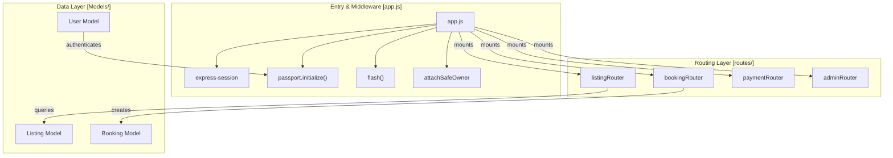
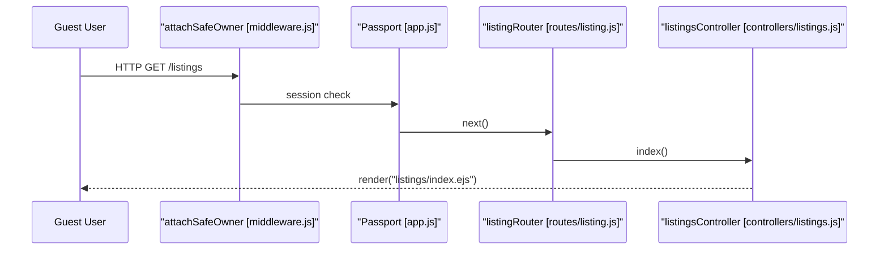
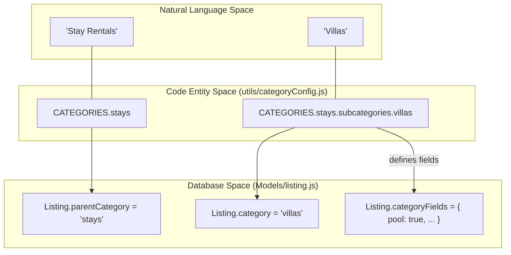
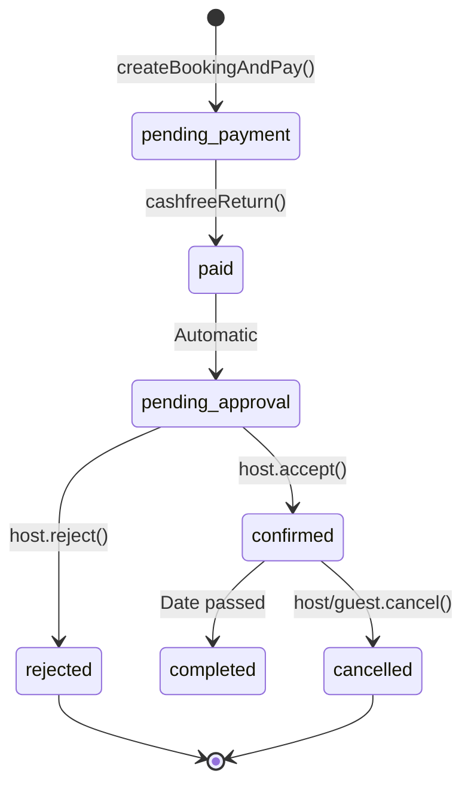
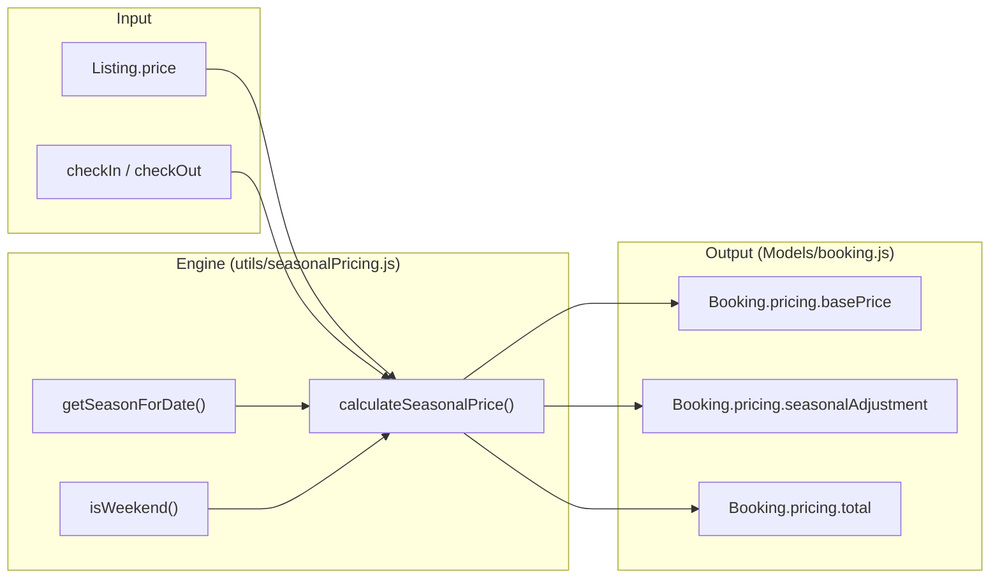
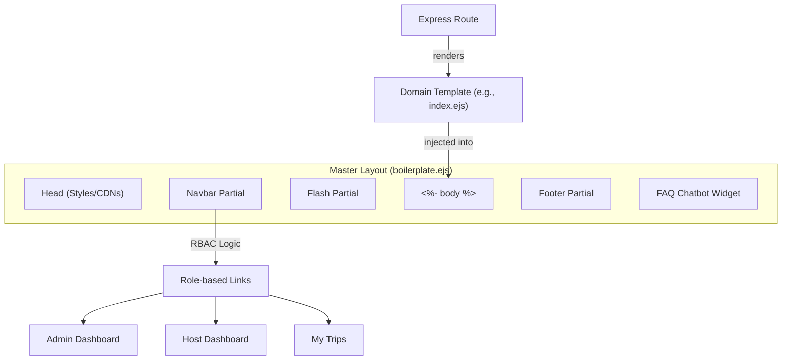
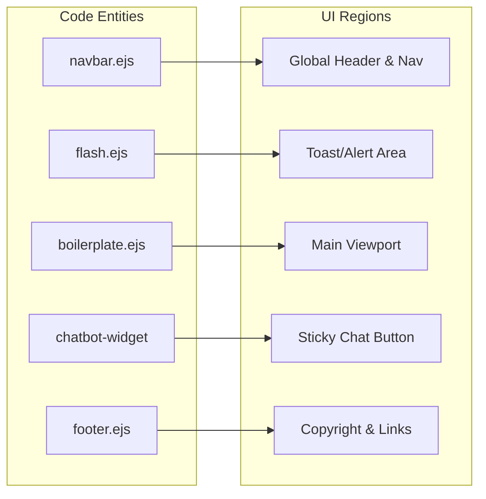

# 🏠 RentSphere — Smart Multi-Category Rental Platform

RentSphere is a full-stack multi-category rental platform designed to facilitate listing discovery, booking management, and secure payments for various rental types, ranging from stays to equipment. The application employs a server-side rendered architecture using Node.js and Express, with a robust data layer powered by MongoDB and Mongoose. [1](#3-0) 

## Table of Contents
- [Features](#features)
- [Tech Stack & Architecture](#tech-stack--architecture)
- [System Architecture](#system-architecture)
- [Technical Concepts & Glossary](#technical-concepts--glossary)
- [Frontend & Views Architecture](#frontend--views-architecture)
- [Live Demo](#live-demo)
- [Project Structure](#project-structure)
- [Prerequisites](#prerequisites)
- [Installation](#installation)
- [Configuration](#configuration)
- [Database Seeding](#database-seeding)
- [Running the Application](#running-the-application)
- [Important Files](#important-files)
- [Deployment Notes](#deployment-notes)
- [Contributing](#contributing)
- [License](#license)
- [Author](#author)

## Features

- **Multi-Category Listings:** Support for diverse rental types with advanced filtering by price, ratings, and availability [2](#3-1) 
- **Dynamic Pricing:** A seasonal pricing engine that adjusts costs based on peak, summer, monsoon, or regular periods [3](#3-2) 
- **Booking Lifecycle:** End-to-end flow from date selection and conflict detection to payment confirmation [4](#3-3) 
- **Admin Oversight:** Comprehensive dashboard for managing users, approving listings, and monitoring revenue [5](#3-4) 
- **Media Management:** Automated image uploads and transformations via Cloudinary [6](#3-5) 
- **User Authentication:** Secure signup and login using Passport.js with session management [7](#3-6) 
- **Reviews & Ratings:** User feedback system for listings with rating aggregation [8](#3-7) 
- **Smart Chatbot:** In-app AI assistant for user support [9](#3-8) 

## Tech Stack & Architecture

RentSphere follows a standard MVC-inspired pattern for Express applications, utilizing EJS for templating and Passport.js for authentication. [10](#3-9) 

| Layer | Technology | Role |
| :--- | :--- | :--- |
| **Backend** | Node.js / Express | Core application logic and routing [11](#3-10)  |
| **Database** | MongoDB / Mongoose | Persistent storage and schema modeling [12](#3-11)  |
| **Frontend** | EJS / Bootstrap | Server-side rendering and UI styling [13](#3-12) [14](#3-13)  |
| **Auth** | Passport.js | Local authentication strategy [15](#3-14)  |
| **Storage** | Cloudinary | Image hosting and management [16](#3-15)  |
| **Payments** | Cashfree SDK | Payment processing integration [17](#3-16)  |

## System Architecture

### System Relationship Diagram

This diagram illustrates how the core components interact within the `app.js` entry point and across the project directory structure.

### Request Processing Flow

The following diagram maps the Natural Language request flow to specific code entities and middleware defined in the codebase.

### Application Entry & Configuration

The application initializes by loading environment variables from a `.env` file. It establishes a connection to MongoDB using `mongoose.connect` and configures a `MongoStore` for persistent session management. [18](#3-17) [19](#3-18) [20](#3-19) 

## Technical Concepts & Glossary

### Listing & Taxonomy

RentSphere uses a two-tier classification system for all rentable items, driven by a centralized configuration utility.

- **Parent Category**: The top-level classification (e.g., `stays`, `vehicles`, `equipment`). It defines the global `pricingUnit` (e.g., "night" for stays, "hour" for professional spaces)
- **Category (Subcategory)**: The specific type of listing (e.g., `villas`, `cars`, `drones`). These determine the `categoryFields` schema
- **Category Fields**: A `Schema.Types.Mixed` field in the `Listing` model that stores dynamic metadata based on the category (e.g., `bedrooms` for stays vs `fuelType` for vehicles)
- **Pricing Unit**: The temporal denominator for costs, stored in the `pricingUnit` field. Supported values: `night`, `hour`, `day`, `week`

#### Taxonomy Mapping Diagram

### Booking Lifecycle & Statuses

The `Booking` model tracks the state of a reservation through the `status` field. Understanding these transitions is critical for debugging the booking and payment flows.

| Status | Meaning | Triggering Function/Action |
| :--- | :--- | :--- |
| `pending_payment` | User has selected dates but not yet completed the checkout. | `createBookingAndPay` |
| `paid` | Payment confirmed via Cashfree API. | `cashfreeReturn` |
| `pending_approval` | Alias for `paid`; the host must now accept or reject. | `Booking` schema enum |
| `confirmed` | Host has accepted the booking request. | `acceptBooking` (Booking Controller) |
| `cancelled` | Either guest or host revoked the booking. | `cancelBooking` (Booking Controller) |

#### Booking State Transitions Diagram

### Pricing Engine Concepts

The system uses a dynamic pricing engine to calculate costs based on time of year and day of the week.

- **Base Nightly Rate**: The static price set by the owner in `Listing.price`
- **Seasonal Multiplier**: A coefficient defined in `SEASONAL_CONFIG` (e.g., `peak` is `1.3`)
- **Weekend Multiplier**: A fixed `1.1` (+10%) surcharge applied to Saturdays and Sundays
- **Season Breakdown**: An array of objects stored in `Booking.pricing.seasonBreakdown` detailing the rate and multiplier for every individual day of a stay

#### Pricing Calculation Flow Diagram

### Authentication & RBAC

RentSphere implements Role-Based Access Control (RBAC) via `Passport.js` and custom middleware.

**Roles:**
- `guest`: Default role; can search, review, and book listings.
- `host`: Can create and manage their own listings and bookings.
- `admin`: Full access to the dashboard, user management, and listing approval.

**Middleware Guards:**
- `isLoggedIn`: Ensures `req.isAuthenticated()` is true
- `isOwner`: Checks if `req.user._id` matches `Listing.owner`
- `isNotBlocked`: Prevents users with `isBlocked: true` from accessing the app

### Third-Party Integrations

- **Cashfree**: The payment gateway provider. The codebase uses `cfPaymentSessionId` to render the checkout component and `cfOrderId` to track the transaction in the `Payment` block of the booking
- **Cloudinary**: Image hosting service. Listing images are stored as objects containing a `url` and `filename`
- **Nominatim (OpenStreetMap)**: Used for geocoding. The system sends the `location` and `country` to the Nominatim API to retrieve `geometry` (GeoJSON Point) coordinates

## Frontend & Views Architecture

### Layout & Architecture

RentSphere utilizes a central layout pattern where a master file, `boilerplate.ejs`, defines the HTML skeleton, global CDN includes (Bootstrap, Font Awesome, Leaflet), and the core flexbox structure. [21](#3-20) 

The architecture follows a standard Express-EJS flow:
1. **Layout**: `boilerplate.ejs` provides the header (`<head>`), navigation, and footer.
2. **Partials**: Common components like `navbar.ejs`, `footer.ejs`, and `flash.ejs` are included via EJS `<%- include() %>` directives
3. **Body**: Specific route templates are injected into the `<%- body %>` placeholder within the layout

### Visual System Map

The following diagram illustrates how the EJS templates are assembled to form a complete page.

#### Template Assembly Flow

### Component Overview

#### Global Components
The global UI is driven by several key partials and embedded widgets:
- **Navbar**: Implements Role-Based Access Control (RBAC) to display different links for Guests, Hosts, and Admins [22](#3-21) . It also contains the global search bar
- **Flash Messages**: Handles success and error alerts globally
- **FAQ Chatbot**: A persistent widget embedded in the layout that provides quick replies for common user queries [21](#3-20) 

#### Major View Groups
The frontend is divided into functional areas:
- **Listings**: Templates for browsing (grid view), viewing details (Leaflet maps, reviews), and managing listing content
- **Bookings & Payments**: Views for the reservation flow, including date selection, pricing breakdowns, and the Cashfree payment gateway interface
- **User Auth & Assets**: Templates for signup/login and the static CSS/JS files that drive interactivity

### Code-to-UI Mapping

This diagram maps specific EJS partials and layout sections to the resulting UI components.

#### UI Entity Mapping

## Live Demo

If a live demo is available it is listed in the repository README (example: https://project1-2tfo.onrender.com/listings). If you run the app locally you can access it at http://localhost:3000/listings by default. <cite repo="CodeManBist/RentSphere" path="README.md" start

